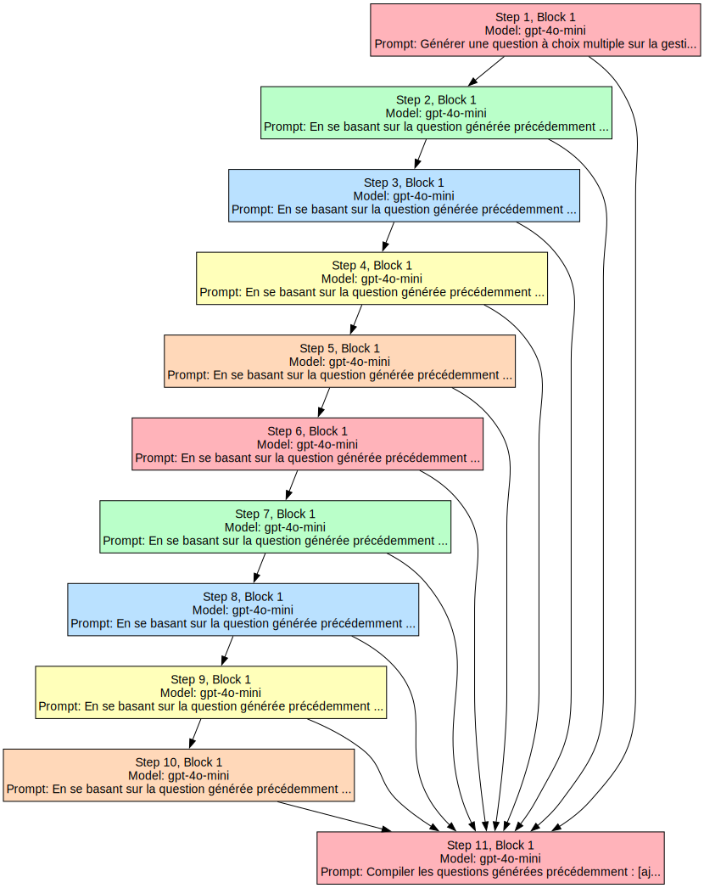

```python
import asyncio
import aiohttp
import nest_asyncio
import os
import logging
from dotenv import load_dotenv
from colorama import init, Fore, Style
from graphviz import Source
from IPython.display import display
from bs4 import BeautifulSoup
from abc import ABC, abstractmethod
from typing import List, Dict, Any, Optional, Tuple
import numpy as np
import json
import re
import tiktoken
import csv
import io
from fpdf import FPDF

# Set up logging
logging.basicConfig(level=logging.INFO, format='%(asctime)s - %(levelname)s - %(message)s')

# Initialize colorama and nest_asyncio for Jupyter environments
init(autoreset=True)
nest_asyncio.apply()

# Load environment variables
load_dotenv()

# Check if API keys are set
api_keys = {
    "openai": os.getenv("OPENAI_API_KEY"),
    "anthropic": os.getenv("ANTHROPIC_API_KEY"),
    "mistral": os.getenv("MISTRAL_API_KEY")
}

for api, key in api_keys.items():
    if not key:
        logging.warning(f"{api.upper()}_API_KEY is not set in the environment variables.")

def num_tokens_from_string(string: str, model_name: str) -> int:
    encoding = tiktoken.encoding_for_model(model_name)
    return len(encoding.encode(string))

class APIException(Exception):
    """Custom exception for API-related errors."""
    pass

class ModelAPI(ABC):
    @abstractmethod
    async def generate_text(self, session: aiohttp.ClientSession, model: str, prompt: str, 
                            temperature: float, max_tokens: int) -> Dict[str, Any]:
        pass

    @abstractmethod
    def extract_text_from_response(self, response: Dict[str, Any]) -> str:
        pass

class OpenAIAPI(ModelAPI):
    def __init__(self, api_key: str):
        self.api_key = api_key

    async def generate_text(self, session: aiohttp.ClientSession, model: str, prompt: str, 
                            temperature: float, max_tokens: int) -> Dict[str, Any]:
        url = "https://api.openai.com/v1/chat/completions"
        headers = {
            "Content-Type": "application/json",
            "Authorization": f"Bearer {self.api_key}"
        }
        data = {
            "model": model,
            "messages": [{"role": "user", "content": prompt}],
            "temperature": temperature,
            "max_tokens": max_tokens,
        }
        async with session.post(url, headers=headers, json=data) as response:
            if response.status != 200:
                raise APIException(f"OpenAI API error: {await response.text()}")
            return await response.json()

    def extract_text_from_response(self, response: Dict[str, Any]) -> str:
        return response["choices"][0]["message"]["content"].strip()

    async def get_embeddings(self, session: aiohttp.ClientSession, texts: List[str]) -> List[List[float]]:
        url = "https://api.openai.com/v1/embeddings"
        headers = {
            "Content-Type": "application/json",
            "Authorization": f"Bearer {self.api_key}"
        }
        data = {
            "model": "text-embedding-ada-002",
            "input": texts
        }
        async with session.post(url, headers=headers, json=data) as response:
            if response.status != 200:
                raise APIException(f"OpenAI Embedding API error: {await response.text()}")
            result = await response.json()
            return [item['embedding'] for item in result['data']]

class AnthropicAPI(ModelAPI):
    def __init__(self, api_key: str):
        self.api_key = api_key

    async def generate_text(self, session: aiohttp.ClientSession, model: str, prompt: str, 
                            temperature: float, max_tokens: int) -> Dict[str, Any]:
        url = "https://api.anthropic.com/v1/messages"
        headers = {
            "Content-Type": "application/json",
            "x-api-key": self.api_key,
            "anthropic-version": "2023-06-01"
        }
        data = {
            "model": model,
            "max_tokens": max_tokens,
            "temperature": temperature,
            "messages": [{"role": "user", "content": prompt}]
        }
        async with session.post(url, headers=headers, json=data) as response:
            if response.status != 200:
                raise APIException(f"Anthropic API error: {await response.text()}")
            return await response.json()

    def extract_text_from_response(self, response: Dict[str, Any]) -> str:
        return response["content"][0]["text"].strip()

class MistralAPI(ModelAPI):
    def __init__(self, api_key: str):
        self.api_key = api_key

    async def generate_text(self, session: aiohttp.ClientSession, model: str, prompt: str, 
                            temperature: float, max_tokens: int) -> Dict[str, Any]:
        url = "https://api.mistral.ai/v1/chat/completions"
        headers = {
            "Content-Type": "application/json",
            "Accept": "application/json",
            "Authorization": f"Bearer {self.api_key}"
        }
        data = {
            "model": model,
            "messages": [{"role": "user", "content": prompt}],
            "temperature": temperature,
            "max_tokens": max_tokens,
        }
        async with session.post(url, headers=headers, json=data) as response:
            if response.status != 200:
                raise APIException(f"Mistral API error: {await response.text()}")
            return await response.json()

    def extract_text_from_response(self, response: Dict[str, Any]) -> str:
        return response["choices"][0]["message"]["content"].strip()

class APIClient:
    def __init__(self, api_keys: Dict[str, str]):
        self.apis = {
            "openai": OpenAIAPI(api_keys.get("openai")),
            "anthropic": AnthropicAPI(api_keys.get("anthropic")),
            "mistral": MistralAPI(api_keys.get("mistral")),
        }

    async def generate_text(self, session: aiohttp.ClientSession, model: str, prompt: str, 
                            temperature: float, max_tokens: int) -> str:
        if model.startswith(("gpt", "text-davinci")):
            api_type = "openai"
        elif model.startswith("claude"):
            api_type = "anthropic"
        elif model.startswith("mistral"):
            api_type = "mistral"
        else:
            raise ValueError(f"Unsupported model: {model}")
        
        try:
            token_limit = 16000  # Adjust based on the model
            if num_tokens_from_string(prompt, model) > token_limit:
                logging.info(f"Prompt exceeds token limit. Splitting into multiple parts.")
                return await self.split_and_process(session, model, prompt, temperature, max_tokens, token_limit)
            else:
                response = await self.apis[api_type].generate_text(session, model, prompt, temperature, max_tokens)
                return self.apis[api_type].extract_text_from_response(response)
        except APIException as e:
            logging.error(f"API error: {str(e)}")
            return "Error: Unable to generate text."

    async def split_and_process(self, session: aiohttp.ClientSession, model: str, prompt: str, 
                                temperature: float, max_tokens: int, token_limit: int) -> str:
        parts = self.split_prompt(prompt, token_limit)
        responses = []

        for i, part in enumerate(parts):
            logging.info(f"Processing part {i+1} of {len(parts)}")
            response = await self.generate_text(session, model, part, temperature, max_tokens // len(parts))
            responses.append(response)
            logging.info(f"Completed processing part {i+1}")

        combined_response = " ".join(responses)
        logging.info("All parts processed. Combining responses.")

        if num_tokens_from_string(combined_response, model) > token_limit:
            logging.info("Combined response exceeds token limit. Generating summary.")
            summary_prompt = f"Summarize the following text:\n\n{combined_response}"
            final_response = await self.generate_text(session, model, summary_prompt, temperature, max_tokens)
            logging.info("Summary generated.")
            return final_response
        else:
            logging.info("Returning combined response.")
            return combined_response

    def split_prompt(self, prompt: str, token_limit: int) -> List[str]:
        words = prompt.split()
        parts = []
        current_part = []
        current_tokens = 0

        for word in words:
            word_tokens = num_tokens_from_string(word, "gpt-3.5-turbo")
            if current_tokens + word_tokens > token_limit:
                if current_part:
                    parts.append(" ".join(current_part))
                current_part = [word]
                current_tokens = word_tokens
            else:
                current_part.append(word)
                current_tokens += word_tokens

        if current_part:
            parts.append(" ".join(current_part))

        return parts

    async def get_embeddings(self, session: aiohttp.ClientSession, texts: List[str]) -> List[List[float]]:
        return await self.apis["openai"].get_embeddings(session, texts)

class ExternalData(ABC):
    def __init__(self, source: str):
        self.source = source

    @abstractmethod
    async def load_data(self, session: aiohttp.ClientSession) -> str:
        pass

class WebData(ExternalData):
    async def load_data(self, session: aiohttp.ClientSession) -> str:
        async with session.get(self.source) as response:
            response.raise_for_status()
            text = await response.text()
            soup = BeautifulSoup(text, 'html.parser')
            
            all_text = soup.get_text(separator='\n', strip=True)
            all_text = re.sub(r'<[^>]+>', '', all_text)
            all_text = re.sub(r'\s+', ' ', all_text).strip()
            
            links = [a.get('href') for a in soup.find_all('a', href=True)]
            
            tables = []
            for table in soup.find_all('table'):
                table_data = []
                for row in table.find_all('tr'):
                    row_data = [cell.get_text(strip=True) for cell in row.find_all(['th', 'td'])]
                    table_data.append(row_data)
                tables.append(table_data)
            
            combined_data = {
                "text_content": all_text,
                "links": links,
                "tables": tables
            }
            
            return json.dumps(combined_data, indent=2)

class APIData(ExternalData):
    async def load_data(self, session: aiohttp.ClientSession) -> str:
        async with session.get(self.source) as response:
            response.raise_for_status()
            data = await response.json()
            return json.dumps(data, indent=2)

class TXTData(ExternalData):
    async def load_data(self, session: aiohttp.ClientSession) -> str:
        if self.source.startswith(('http://', 'https://')):
            async with session.get(self.source) as response:
                response.raise_for_status()
                return await response.text()
        else:
            with open(self.source, 'r') as file:
                return file.read()

class CSVData(ExternalData):
    async def load_data(self, session: aiohttp.ClientSession) -> str:
        if self.source.startswith(('http://', 'https://')):
            async with session.get(self.source) as response:
                response.raise_for_status()
                content = await response.text()
        else:
            with open(self.source, 'r') as file:
                content = file.read()

        csv_data = []
        csv_reader = csv.reader(io.StringIO(content))
        for row in csv_reader:
            csv_data.append(row)
        return json.dumps(csv_data, indent=2)

class OutputSaver:
    @staticmethod
    def save_txt(content: str, filename: str):
        with open(filename, 'w', encoding='utf-8') as file:
            file.write(content)

    @staticmethod
    def save_pdf(content: str, filename: str):
        pdf = FPDF()
        pdf.add_page()
        pdf.set_font("Arial", size=12)
        pdf.multi_cell(0, 10, content)
        pdf.output(filename)

class PromptBlock:
    def __init__(self, prompt: str, model: str = "gpt-3.5-turbo", max_tokens: int = 2000, 
                 temperature: float = 0.7, external_data: Optional[ExternalData] = None,
                 semantic_search: Optional[Dict[str, Any]] = None, 
                 save_output: Optional[Dict[str, str]] = None):
        self.prompt = prompt
        self.model = model
        self.max_tokens = max_tokens
        self.temperature = temperature
        self.output = None
        self.input_blocks: List[Tuple[int, int]] = []
        self.external_data = external_data
        self.semantic_search = semantic_search
        self.save_output = save_output

    def add_input(self, step_index: int, block_index: int):
        self.input_blocks.append((step_index, block_index))

    async def load_external_data(self, session: aiohttp.ClientSession) -> str:
        if not self.external_data:
            return ""
        try:
            return await self.external_data.load_data(session)
        except Exception as e:
            logging.error(f"Error loading external data from {self.external_data.source}: {str(e)}")
            return f"Error loading external data: {str(e)}"

    def save_block_output(self):
        if self.save_output and self.output:
            output_format = self.save_output.get('format', 'txt').lower()
            filename = self.save_output.get('filename', f'output_{id(self)}.{output_format}')
            
            if output_format == 'txt':
                OutputSaver.save_txt(self.output, filename)
            elif output_format == 'pdf':
                OutputSaver.save_pdf(self.output, filename)
            else:
                raise ValueError(f"Unsupported output format: {output_format}")
            
            print(f"Output saved to {filename}")

class Step:
    def __init__(self):
        self.blocks: List[PromptBlock] = []

    def add_block(self, block: PromptBlock):
        self.blocks.append(block)

class SemanticSearch:
    def __init__(self, api_client: APIClient, words_per_chunk: int = 100):
        self.api_client = api_client
        self.words_per_chunk = words_per_chunk

    @staticmethod
    def split_text(text: str, words_per_chunk: int) -> List[str]:
        words = text.split()
        return [' '.join(words[i:i+words_per_chunk]) for i in range(0, len(words), words_per_chunk)]

    @staticmethod
    def cosine_similarity(vec1: List[float], vec2: List[float]) -> float:
        return np.dot(vec1, vec2) / (np.linalg.norm(vec1) * np.linalg.norm(vec2))

    async def search(self, session: aiohttp.ClientSession, query: str, text: str, top_k: int) -> List[Tuple[str, float]]:
        chunks = self.split_text(text, self.words_per_chunk)
        query_embedding = await self.api_client.get_embeddings(session, [query])
        chunk_embeddings = await self.api_client.get_embeddings(session, chunks)
        
        similarities = [self.cosine_similarity(query_embedding[0], chunk_emb) for chunk_emb in chunk_embeddings]
        top_indices = np.argsort(similarities)[-top_k:][::-1]
        return [(chunks[i], similarities[i]) for i in top_indices]

class FlowManager:
    def __init__(self, api_keys: Dict[str, str], words_per_chunk: int = 100, default_top_k: int = 3):
        self.steps: List[Step] = []
        self.api_client = APIClient(api_keys)
        self.semantic_search = SemanticSearch(self.api_client, words_per_chunk)
        self.default_top_k = default_top_k

    def add_step(self, step: Step):
        self.steps.append(step)

    async def process_step(self, step_index: int):
        if step_index == 0:
            for block in self.steps[step_index].blocks:
                if block.input_blocks:
                    logging.warning(f"Step 1, Block cannot have inputs from other blocks.")
                    return

        async with aiohttp.ClientSession() as session:
            tasks = []
            for block in self.steps[step_index].blocks:
                all_input_texts = self.collect_input_texts(step_index, block)
                
                external_data_text = await block.load_external_data(session)
                logging.info(f"External data for Step {step_index + 1}, Block {len(tasks) + 1}: {external_data_text[:100]}...")
                
                if block.semantic_search:
                    query = block.semantic_search.get('query', '')
                    top_k = block.semantic_search.get('top_k', self.default_top_k)
                    search_inputs = block.semantic_search.get('inputs', ['all'])
                    
                    relevant_chunks = []
                    
                    if 'all' in search_inputs or 'previous' in search_inputs:
                        input_search_text = '\n'.join(all_input_texts)
                        relevant_input_chunks = await self.semantic_search.search(session, query, input_search_text, top_k)
                        relevant_chunks.extend(relevant_input_chunks)
                    
                    if 'all' in search_inputs or 'external' in search_inputs:
                        if external_data_text:
                            relevant_external_chunks = await self.semantic_search.search(session, query, external_data_text, top_k)
                            relevant_chunks.extend(relevant_external_chunks)
                    
                    input_texts = [chunk for chunk, _ in relevant_chunks]
                    logging.info(f"Semantic search results: {[(chunk[:100], score) for chunk, score in relevant_chunks[:2]]}")
                else:
                    input_texts = all_input_texts + ([external_data_text] if external_data_text else [])

                if input_texts:
                    merged_input = "\n".join(input_texts)
                    block.prompt = f"{merged_input}\n\n{block.prompt}"

                logging.info(f"Processing Step {step_index + 1}, Block {len(tasks) + 1}")
                logging.info(f"Prompt: {block.prompt[:100]}...")

                task = self.api_client.generate_text(
                    session, block.model, block.prompt, block.temperature, block.max_tokens
                )
                tasks.append(task)

            results = await asyncio.gather(*tasks)
            for block, result in zip(self.steps[step_index].blocks, results):
                block.output = result
                block.save_block_output()

    def collect_input_texts(self, step_index: int, block: PromptBlock) -> List[str]:
        return [self.steps[input_step].blocks[input_block].output 
                for input_step, input_block in block.input_blocks 
                if input_step < step_index]

    async def run_flow(self):
        self.visualize_flow()
        for i in range(len(self.steps)):
            await self.process_step(i)
            self.display_step_results(i)

    def display_step_results(self, step_index: int):
        print(f"\n{Fore.GREEN}{Style.BRIGHT}Step {step_index + 1} Results:{Style.RESET_ALL}")
        for j, block in enumerate(self.steps[step_index].blocks):
            print(f"{Fore.BLUE}{Style.BRIGHT}Block {j + 1} (Model: {block.model}, Max Tokens: {block.max_tokens}):{Style.RESET_ALL}")
            print(f"\n{Fore.YELLOW}Output:{Style.RESET_ALL} {block.output}\n")

    def visualize_flow(self):
        dot_code = self.generate_dot_code()
        graph = Source(dot_code)
        display(graph)

    def generate_dot_code(self) -> str:
        dot_code = """
        digraph G {
            node [style="filled", fontname="Arial", shape="box", margin="0.2,0.1"];
            edge [fontname="Arial"];
        """
        
        colors = ["#FFB3BA", "#BAFFC9", "#BAE1FF", "#FFFFBA", "#FFD8B9"]
        
        for i, step in enumerate(self.steps):
            step_color = colors[i % len(colors)]
            for j, block in enumerate(step.blocks):
                node_id = f"Block{i+1}_{j+1}"
                external_data_info = f"\\nExternal Data: {type(block.external_data).__name__}" if block.external_data else ""
                semantic_search_info = "\\nSemantic Search" if block.semantic_search else ""
                label = f"Step {i+1}, Block {j+1}\\nModel: {block.model}{external_data_info}{semantic_search_info}\\nPrompt: {block.prompt[:50]}..."
                dot_code += f'    {node_id} [label="{label}", fillcolor="{step_color}"];\n'
                for input_step, input_block in block.input_blocks:
                    input_id = f"Block{input_step+1}_{input_block+1}"
                    dot_code += f"    {input_id} -> {node_id};\n"
        
        dot_code += "}"
        return dot_code

def create_modular_flow(steps_config: List[Dict[str, Any]], api_keys: Dict[str, str], words_per_chunk: int = 100, default_top_k: int = 3) -> FlowManager:
    flow_manager = FlowManager(api_keys, words_per_chunk=words_per_chunk, default_top_k=default_top_k)
    
    for step_config in steps_config:
        step = Step()
        for block_config in step_config['blocks']:
            external_data = None
            if 'external_data' in block_config:
                data_type = block_config['external_data']['type']
                source = block_config['external_data']['source']
                if data_type == 'web':
                    external_data = WebData(source)
                elif data_type == 'api':
                    external_data = APIData(source)
                elif data_type == 'txt':
                    external_data = TXTData(source)
                elif data_type == 'csv':
                    external_data = CSVData(source)

            block = PromptBlock(
                prompt=block_config['prompt'],
                model=block_config.get('model', 'gpt-3.5-turbo'),
                max_tokens=block_config.get('max_tokens', 2000),
                temperature=block_config.get('temperature', 0.7),
                external_data=external_data,
                semantic_search=block_config.get('semantic_search'),
                save_output=block_config.get('save_output')
            )
            for input_ref in block_config.get('inputs', []):
                block.add_input(input_ref[0], input_ref[1])
            step.add_block(block)
        flow_manager.add_step(step)
    
    return flow_manager

```


```python
steps_config = [
    {
        "blocks": [
            {
                "prompt": "Générer une question à choix multiple sur la gestion de portefeuille, avec trois choix de réponses.",
                "model": "gpt-4o-mini",
                "max_tokens": 150,
                "temperature": 0.7,
                "save_output": {
                    "format": "txt",
                    "filename": "question_1.txt"
                }
            }
        ]
    },
    {
        "blocks": [
            {
                "prompt": "En se basant sur la question générée précédemment : [ajoutez ici la sortie de question_1.txt], générer une nouvelle question à choix multiple sur la gestion de portefeuille.",
                "model": "gpt-4o-mini",
                "max_tokens": 150,
                "temperature": 0.7,
                "inputs": [(0, 0)],  # Référence à la première question
                "save_output": {
                    "format": "txt",
                    "filename": "question_2.txt"
                }
            }
        ]
    },
    {
        "blocks": [
            {
                "prompt": "En se basant sur la question générée précédemment : [ajoutez ici la sortie de question_2.txt], générer une nouvelle question à choix multiple sur la gestion de portefeuille.",
                "model": "gpt-4o-mini",
                "max_tokens": 150,
                "temperature": 0.7,
                "inputs": [(1, 0)],  # Référence à la deuxième question
                "save_output": {
                    "format": "txt",
                    "filename": "question_3.txt"
                }
            }
        ]
    },
    {
        "blocks": [
            {
                "prompt": "En se basant sur la question générée précédemment : [ajoutez ici la sortie de question_3.txt], générer une nouvelle question à choix multiple sur la gestion de portefeuille.",
                "model": "gpt-4o-mini",
                "max_tokens": 150,
                "temperature": 0.7,
                "inputs": [(2, 0)],  # Référence à la troisième question
                "save_output": {
                    "format": "txt",
                    "filename": "question_4.txt"
                }
            }
        ]
    },
    {
        "blocks": [
            {
                "prompt": "En se basant sur la question générée précédemment : [ajoutez ici la sortie de question_4.txt], générer une nouvelle question à choix multiple sur la gestion de portefeuille.",
                "model": "gpt-4o-mini",
                "max_tokens": 150,
                "temperature": 0.7,
                "inputs": [(3, 0)],  # Référence à la quatrième question
                "save_output": {
                    "format": "txt",
                    "filename": "question_5.txt"
                }
            }
        ]
    },
    {
        "blocks": [
            {
                "prompt": "En se basant sur la question générée précédemment : [ajoutez ici la sortie de question_5.txt], générer une nouvelle question à choix multiple sur la gestion de portefeuille.",
                "model": "gpt-4o-mini",
                "max_tokens": 150,
                "temperature": 0.7,
                "inputs": [(4, 0)],  # Référence à la cinquième question
                "save_output": {
                    "format": "txt",
                    "filename": "question_6.txt"
                }
            }
        ]
    },
    {
        "blocks": [
            {
                "prompt": "En se basant sur la question générée précédemment : [ajoutez ici la sortie de question_6.txt], générer une nouvelle question à choix multiple sur la gestion de portefeuille.",
                "model": "gpt-4o-mini",
                "max_tokens": 150,
                "temperature": 0.7,
                "inputs": [(5, 0)],  # Référence à la sixième question
                "save_output": {
                    "format": "txt",
                    "filename": "question_7.txt"
                }
            }
        ]
    },
    {
        "blocks": [
            {
                "prompt": "En se basant sur la question générée précédemment : [ajoutez ici la sortie de question_7.txt], générer une nouvelle question à choix multiple sur la gestion de portefeuille.",
                "model": "gpt-4o-mini",
                "max_tokens": 150,
                "temperature": 0.7,
                "inputs": [(6, 0)],  # Référence à la septième question
                "save_output": {
                    "format": "txt",
                    "filename": "question_8.txt"
                }
            }
        ]
    },
    {
        "blocks": [
            {
                "prompt": "En se basant sur la question générée précédemment : [ajoutez ici la sortie de question_8.txt], générer une nouvelle question à choix multiple sur la gestion de portefeuille.",
                "model": "gpt-4o-mini",
                "max_tokens": 150,
                "temperature": 0.7,
                "inputs": [(7, 0)],  # Référence à la huitième question
                "save_output": {
                    "format": "txt",
                    "filename": "question_9.txt"
                }
            }
        ]
    },
    {
        "blocks": [
            {
                "prompt": "En se basant sur la question générée précédemment : [ajoutez ici la sortie de question_9.txt], générer une nouvelle question à choix multiple sur la gestion de portefeuille.",
                "model": "gpt-4o-mini",
                "max_tokens": 150,
                "temperature": 0.7,
                "inputs": [(8, 0)],  # Référence à la neuvième question
                "save_output": {
                    "format": "txt",
                    "filename": "question_10.txt"
                }
            }
        ]
    },
    {
        "blocks": [
            {
                "prompt": "Compiler les questions générées précédemment : [ajoutez ici les sorties des fichiers de questions]. Formater en un rapport d'examen à choix multiple sur la gestion de portefeuille et sauvegarder en PDF.",
                "model": "gpt-4o-mini",
                "max_tokens": 2000,
                "temperature": 0.7,
                "inputs": [(0, 0), (1, 0), (2, 0), (3, 0), (4, 0), (5, 0), (6, 0), (7, 0), (8, 0), (9, 0)],  # Références à toutes les questions
                "save_output": {
                    "format": "pdf",
                    "filename": "examen_gestion_portefeuille.pdf"
                }
            }
        ]
    }
]

# Continuez avec la création du FlowManager et l'exécution comme dans votre code précédent

```


```python
flow_manager = create_modular_flow(steps_config, api_keys)
await flow_manager.run_flow()

```


    

    


    2024-09-19 09:42:16,310 - INFO - External data for Step 1, Block 1: ...
    2024-09-19 09:42:16,310 - INFO - Processing Step 1, Block 1
    2024-09-19 09:42:16,311 - INFO - Prompt: Générer une question à choix multiple sur la gestion de portefeuille, avec trois choix de réponses....


    Output saved to question_1.txt
    
    Step 1 Results:
    Block 1 (Model: gpt-4o-mini, Max Tokens: 150):
    
    Output: Bien sûr ! Voici une question à choix multiple sur la gestion de portefeuille :
    
    **Quelle est l'approche principale de la gestion de portefeuille moderne pour optimiser le rendement tout en minimisant le risque ?**
    
    A) L'analyse technique des actifs financiers.  
    B) La diversification des investissements à travers différentes classes d'actifs.  
    C) L'investissement exclusif dans des actions à forte capitalisation.  
    
    **Réponse correcte : B) La diversification des investissements à travers différentes classes d'actifs.**
    


    2024-09-19 09:42:18,151 - INFO - External data for Step 2, Block 1: ...
    2024-09-19 09:42:18,152 - INFO - Processing Step 2, Block 1
    2024-09-19 09:42:18,152 - INFO - Prompt: Bien sûr ! Voici une question à choix multiple sur la gestion de portefeuille :
    
    **Quelle est l'appr...


    Output saved to question_2.txt
    
    Step 2 Results:
    Block 1 (Model: gpt-4o-mini, Max Tokens: 150):
    
    Output: Voici une nouvelle question à choix multiple sur la gestion de portefeuille :
    
    **Quel est l'objectif principal de l'allocation d'actifs dans la gestion de portefeuille ?**
    
    A) Maximiser les gains à court terme à tout prix.  
    B) Répartir les investissements afin de réduire le risque global du portefeuille.  
    C) Investir uniquement dans des obligations gouvernementales.  
    
    **Réponse correcte : B) Répartir les investissements afin de réduire le risque global du portefeuille.**
    


    2024-09-19 09:42:20,609 - INFO - External data for Step 3, Block 1: ...
    2024-09-19 09:42:20,609 - INFO - Processing Step 3, Block 1
    2024-09-19 09:42:20,610 - INFO - Prompt: Voici une nouvelle question à choix multiple sur la gestion de portefeuille :
    
    **Quel est l'objectif...


    Output saved to question_3.txt
    
    Step 3 Results:
    Block 1 (Model: gpt-4o-mini, Max Tokens: 150):
    
    Output: Voici une nouvelle question à choix multiple sur la gestion de portefeuille :
    
    **Quel est l'un des principaux avantages de la diversification dans un portefeuille d'investissement ?**
    
    A) Augmenter la liquidité de tous les actifs du portefeuille.  
    B) Assurer un rendement positif garanti sur l'ensemble des investissements.  
    C) Réduire la volatilité et le risque spécifique d'un actif.  
    
    **Réponse correcte : C) Réduire la volatilité et le risque spécifique d'un actif.**
    


    2024-09-19 09:42:22,247 - INFO - External data for Step 4, Block 1: ...
    2024-09-19 09:42:22,247 - INFO - Processing Step 4, Block 1
    2024-09-19 09:42:22,247 - INFO - Prompt: Voici une nouvelle question à choix multiple sur la gestion de portefeuille :
    
    **Quel est l'un des p...


    Output saved to question_4.txt
    
    Step 4 Results:
    Block 1 (Model: gpt-4o-mini, Max Tokens: 150):
    
    Output: **Quelle est l'une des stratégies clés pour évaluer la performance d'un portefeuille d'investissement ?**
    
    A) Comparer le rendement du portefeuille à celui d'un indice de référence approprié.  
    B) Analyser uniquement les frais de gestion du portefeuille.  
    C) Se concentrer exclusivement sur les actifs à faible risque.  
    
    **Réponse correcte : A) Comparer le rendement du portefeuille à celui d'un indice de référence approprié.**
    


    2024-09-19 09:42:24,500 - INFO - External data for Step 5, Block 1: ...
    2024-09-19 09:42:24,501 - INFO - Processing Step 5, Block 1
    2024-09-19 09:42:24,501 - INFO - Prompt: **Quelle est l'une des stratégies clés pour évaluer la performance d'un portefeuille d'investissemen...


    Output saved to question_5.txt
    
    Step 5 Results:
    Block 1 (Model: gpt-4o-mini, Max Tokens: 150):
    
    Output: **Quelle est l'une des considérations importantes lors de la diversification d'un portefeuille d'investissement ?**
    
    A) Investir uniquement dans des actions de la même industrie.  
    B) Inclure des actifs de différentes classes pour réduire le risque global.  
    C) Se concentrer uniquement sur des investissements à court terme.  
    
    **Réponse correcte : B) Inclure des actifs de différentes classes pour réduire le risque global.**
    


    2024-09-19 09:42:25,857 - INFO - External data for Step 6, Block 1: ...
    2024-09-19 09:42:25,857 - INFO - Processing Step 6, Block 1
    2024-09-19 09:42:25,858 - INFO - Prompt: **Quelle est l'une des considérations importantes lors de la diversification d'un portefeuille d'inv...


    Output saved to question_6.txt
    
    Step 6 Results:
    Block 1 (Model: gpt-4o-mini, Max Tokens: 150):
    
    Output: **Quelle est l'une des stratégies clés pour gérer le risque dans un portefeuille d'investissement ?**
    
    A) Se fier uniquement à des recommandations d'amis pour choisir des titres.  
    B) Rééquilibrer régulièrement le portefeuille pour maintenir une allocation d'actifs cible.  
    C) Investir uniquement dans des fonds indiciels.  
    
    **Réponse correcte : B) Rééquilibrer régulièrement le portefeuille pour maintenir une allocation d'actifs cible.**
    


    2024-09-19 09:42:27,166 - INFO - External data for Step 7, Block 1: ...
    2024-09-19 09:42:27,167 - INFO - Processing Step 7, Block 1
    2024-09-19 09:42:27,167 - INFO - Prompt: **Quelle est l'une des stratégies clés pour gérer le risque dans un portefeuille d'investissement ?*...


    Output saved to question_7.txt
    
    Step 7 Results:
    Block 1 (Model: gpt-4o-mini, Max Tokens: 150):
    
    Output: **Quelle est l'importance de la diversification dans un portefeuille d'investissement ?**
    
    A) Elle permet de maximiser les gains en investissant uniquement dans des actions à forte volatilité.  
    B) Elle réduit le risque global en répartissant les investissements sur différents actifs.  
    C) Elle garantit un rendement positif à tous les coups.  
    
    **Réponse correcte : B) Elle réduit le risque global en répartissant les investissements sur différents actifs.**
    


    2024-09-19 09:42:29,514 - INFO - External data for Step 8, Block 1: ...
    2024-09-19 09:42:29,515 - INFO - Processing Step 8, Block 1
    2024-09-19 09:42:29,516 - INFO - Prompt: **Quelle est l'importance de la diversification dans un portefeuille d'investissement ?**
    
    A) Elle p...


    Output saved to question_8.txt
    
    Step 8 Results:
    Block 1 (Model: gpt-4o-mini, Max Tokens: 150):
    
    Output: **Quelle stratégie est souvent recommandée pour optimiser la liquidité d'un portefeuille d'investissement ?**
    
    A) Investir uniquement dans des obligations à long terme.  
    B) Conserver une part de l'actif en espèces ou en équivalents de liquidités.  
    C) Concentrer tous les investissements dans des actions technologiques.  
    
    **Réponse correcte : B) Conserver une part de l'actif en espèces ou en équivalents de liquidités.**
    


    2024-09-19 09:42:30,639 - INFO - External data for Step 9, Block 1: ...
    2024-09-19 09:42:30,640 - INFO - Processing Step 9, Block 1
    2024-09-19 09:42:30,640 - INFO - Prompt: **Quelle stratégie est souvent recommandée pour optimiser la liquidité d'un portefeuille d'investiss...


    Output saved to question_9.txt
    
    Step 9 Results:
    Block 1 (Model: gpt-4o-mini, Max Tokens: 150):
    
    Output: **Quelle méthode est souvent utilisée pour réduire le risque d'un portefeuille d'investissement ?**
    
    A) Diversifier les investissements dans différentes classes d'actifs.  
    B) Investir uniquement dans des actions à forte volatilité.  
    C) Concentrer ses investissements dans une seule entreprise bien établie.  
    
    **Réponse correcte : A) Diversifier les investissements dans différentes classes d'actifs.**
    


    2024-09-19 09:42:32,381 - INFO - External data for Step 10, Block 1: ...
    2024-09-19 09:42:32,381 - INFO - Processing Step 10, Block 1
    2024-09-19 09:42:32,382 - INFO - Prompt: **Quelle méthode est souvent utilisée pour réduire le risque d'un portefeuille d'investissement ?**
    ...


    Output saved to question_10.txt
    
    Step 10 Results:
    Block 1 (Model: gpt-4o-mini, Max Tokens: 150):
    
    Output: **Quelle stratégie est couramment utilisée pour optimiser le rendement d'un portefeuille d'investissement tout en gérant le risque ?**
    
    A) Suivre les tendances du marché en investissant uniquement dans les actifs en hausse.  
    B) Rééquilibrer régulièrement le portefeuille pour maintenir une allocation d'actifs cible.  
    C) Éviter les investissements à long terme au profit de gains rapides.  
    
    **Réponse correcte : B) Rééquilibrer régulièrement le portefeuille pour maintenir une allocation d'actifs cible.**
    


    2024-09-19 09:42:34,761 - INFO - External data for Step 11, Block 1: ...
    2024-09-19 09:42:34,761 - INFO - Processing Step 11, Block 1
    2024-09-19 09:42:34,762 - INFO - Prompt: Bien sûr ! Voici une question à choix multiple sur la gestion de portefeuille :
    
    **Quelle est l'appr...


    Output saved to examen_gestion_portefeuille.pdf
    
    Step 11 Results:
    Block 1 (Model: gpt-4o-mini, Max Tokens: 2000):
    
    Output: Voici un rapport d'examen à choix multiple sur la gestion de portefeuille, compilant les questions générées précédemment. Bien que je ne puisse pas créer directement des fichiers PDF, je vais vous fournir le contenu que vous pouvez utiliser pour créer un document PDF.
    
    ---
    
    # Rapport d'examen : Gestion de Portefeuille
    
    ## Instructions
    Pour chaque question, choisissez la réponse qui vous semble correcte.
    
    ### Question 1
    **Quelle est l'approche principale de la gestion de portefeuille moderne pour optimiser le rendement tout en minimisant le risque ?**
    
    A) L'analyse technique des actifs financiers.  
    B) La diversification des investissements à travers différentes classes d'actifs.  
    C) L'investissement exclusif dans des actions à forte capitalisation.  
    
    **Réponse correcte : B)**
    
    ---
    
    ### Question 2
    **Quel est l'objectif principal de l'allocation d'actifs dans la gestion de portefeuille ?**
    
    A) Maximiser les gains à court terme à tout prix.  
    B) Répartir les investissements afin de réduire le risque global du portefeuille.  
    C) Investir uniquement dans des obligations gouvernementales.  
    
    **Réponse correcte : B)**
    
    ---
    
    ### Question 3
    **Quel est l'un des principaux avantages de la diversification dans un portefeuille d'investissement ?**
    
    A) Augmenter la liquidité de tous les actifs du portefeuille.  
    B) Assurer un rendement positif garanti sur l'ensemble des investissements.  
    C) Réduire la volatilité et le risque spécifique d'un actif.  
    
    **Réponse correcte : C)**
    
    ---
    
    ### Question 4
    **Quelle est l'une des stratégies clés pour évaluer la performance d'un portefeuille d'investissement ?**
    
    A) Comparer le rendement du portefeuille à celui d'un indice de référence approprié.  
    B) Analyser uniquement les frais de gestion du portefeuille.  
    C) Se concentrer exclusivement sur les actifs à faible risque.  
    
    **Réponse correcte : A)**
    
    ---
    
    ### Question 5
    **Quelle est l'une des considérations importantes lors de la diversification d'un portefeuille d'investissement ?**
    
    A) Investir uniquement dans des actions de la même industrie.  
    B) Inclure des actifs de différentes classes pour réduire le risque global.  
    C) Se concentrer uniquement sur des investissements à court terme.  
    
    **Réponse correcte : B)**
    
    ---
    
    ### Question 6
    **Quelle est l'une des stratégies clés pour gérer le risque dans un portefeuille d'investissement ?**
    
    A) Se fier uniquement à des recommandations d'amis pour choisir des titres.  
    B) Rééquilibrer régulièrement le portefeuille pour maintenir une allocation d'actifs cible.  
    C) Investir uniquement dans des fonds indiciels.  
    
    **Réponse correcte : B)**
    
    ---
    
    ### Question 7
    **Quelle est l'importance de la diversification dans un portefeuille d'investissement ?**
    
    A) Elle permet de maximiser les gains en investissant uniquement dans des actions à forte volatilité.  
    B) Elle réduit le risque global en répartissant les investissements sur différents actifs.  
    C) Elle garantit un rendement positif à tous les coups.  
    
    **Réponse correcte : B)**
    
    ---
    
    ### Question 8
    **Quelle stratégie est souvent recommandée pour optimiser la liquidité d'un portefeuille d'investissement ?**
    
    A) Investir uniquement dans des obligations à long terme.  
    B) Conserver une part de l'actif en espèces ou en équivalents de liquidités.  
    C) Concentrer tous les investissements dans des actions technologiques.  
    
    **Réponse correcte : B)**
    
    ---
    
    ### Question 9
    **Quelle méthode est souvent utilisée pour réduire le risque d'un portefeuille d'investissement ?**
    
    A) Diversifier les investissements dans différentes classes d'actifs.  
    B) Investir uniquement dans des actions à forte volatilité.  
    C) Concentrer ses investissements dans une seule entreprise bien établie.  
    
    **Réponse correcte : A)**
    
    ---
    
    ### Question 10
    **Quelle stratégie est couramment utilisée pour optimiser le rendement d'un portefeuille d'investissement tout en gérant le risque ?**
    
    A) Suivre les tendances du marché en investissant uniquement dans les actifs en hausse.  
    B) Rééquilibrer régulièrement le portefeuille pour maintenir une allocation d'actifs cible.  
    C) Éviter les investissements à long terme au profit de gains rapides.  
    
    **Réponse correcte : B)**
    
    ---
    
    ## Fin du rapport
    
    Pour créer un PDF, vous pouvez copier ce contenu dans un éditeur de texte ou un traitement de texte comme Microsoft Word, Google Docs, ou un logiciel de création de PDF, puis utiliser la fonction "Enregistrer sous" ou "Exporter" pour le sauvegarder en format PDF.
    


```python

```
